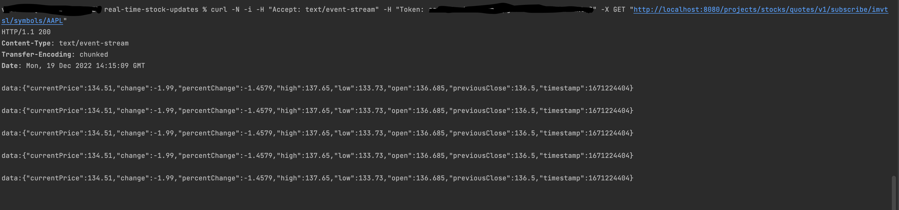

# real-time-stock-price-updates
REAL TIME STOCK PRICE UPDATES

The source repository for Real Time Stock price Updates project.

It provides APIs for streaming live stock price using Server Sent Events. Multiple users can subscribe to stream updates for multiple symbols at the same time.

API key from finnhub.io is required to fetch stock prices. Please see below for more details.

All data structures used are thread-safe.

The application uses web client library to make REST calls to finnhub.io

The application has automated logging for reqeests, responses and event streams.

The application performs input validations.

The application has centralized exception handling using @ControllerAdvice.

The application uses SLF4J and logback for logging.

The application is configured with graceful shutdown.

# Prerequisites to run the application:
Java 11

Gradle

API key from finnhub.io

# Command to build application:
**./gradlew build**

# Command to run application:
**./gradlew bootRun**

# To stream real time stock updates:
Postman doesn't provide support to see stream of Server Sent Events. Therefore, we use cURL.

Add your API key in token header in the below command.

Replace your username in below command to register for this application.

In this example, we are streaming price updates of Apple Inc (AAPL). Replace it with the desired symbol.

curl -N -i -H "Accept: text/event-stream" -H "Token: <Your API key>" -X GET "http://localhost:8080/projects/stocks/quotes/v1/subscribe/{username}/symbols/AAPL"

Sample Output:

# To test other APIs manually import the Postman collection located at:
src/main/resources/Real Time Stock Price Updates.postman_collection.json

# Logging levels:
Change the desired levels in logback.xml and application.properties.

# Graceful shutdown:
Server is configured with graceful shutdown period of 1 minute. To change, modify "spring.lifecycle.timeout-per-shutdown-phase=1m" property in applications.properties.

# OpenAPI Documentation for REST APIs:
While application is running, open below links in the browser:

http://localhost:8080/projects/stocks/swagger-ui/index.html

http://localhost:8080/projects/stocks/v3/api-docs/

# Finnhub.io
This application polls finnhub.io at constant intervals. It then streams the updates to the user.

Get your free API key by registering at below link:

https://finnhub.io/register

